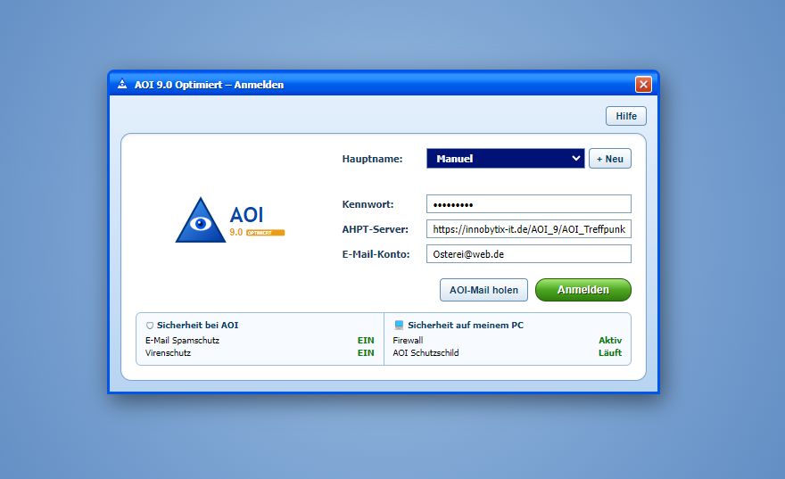
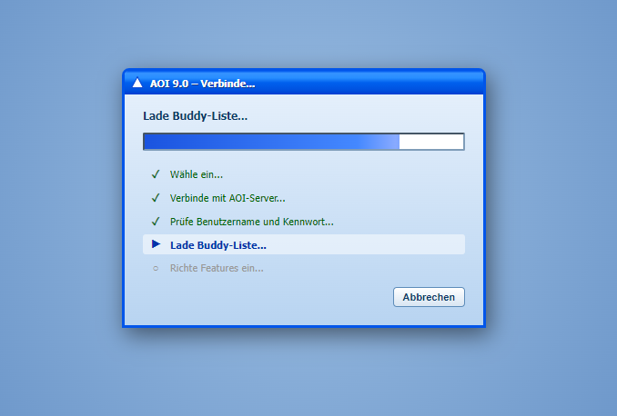
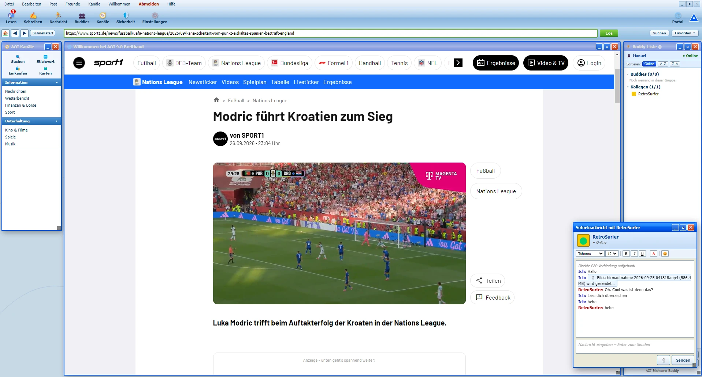
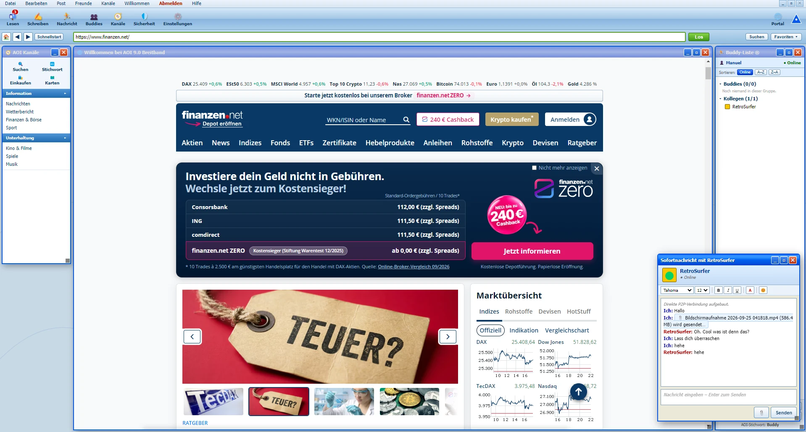
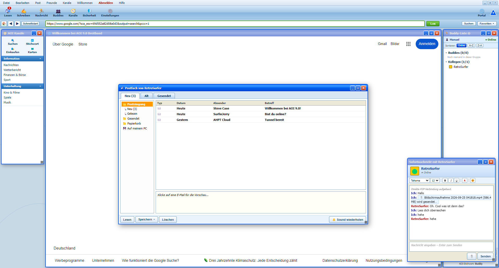
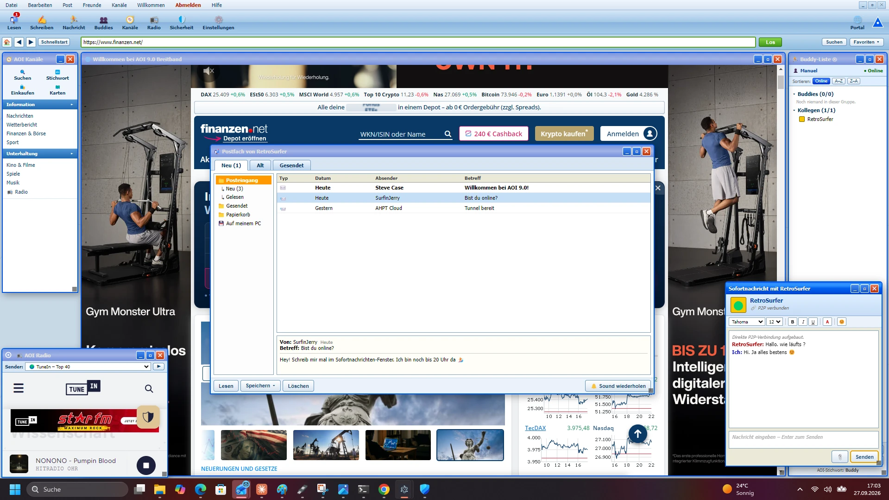

# AOI 9.0 Nostalgia

[](https://github.com/Innobytix-IT/AOI-9.0/releases/latest)
[](https://github.com/Innobytix-IT/AOI-9.0/actions/workflows/build.yml)
[](https://www.gnu.org/licenses/agpl-3.0)
[](https://www.electronjs.org/)
[](https://github.com/Innobytix-IT/AOI-9.0/releases/latest)

**Retro AOL-style Electron desktop app with WebRTC P2P messaging**

AOI 9.0 Nostalgia bringt das Feeling der frühen 2000er zurück – mit moderner Technik darunter.  
Ein klassischer Instant-Messenger-Look, echter P2P-Chat via WebRTC und ein integrierter Webbrowser.

---

## Screenshots

| Anmelden | Verbinden |
|----------|-----------|
|  |  |

| Desktop mit Chat & Sport | Finanzen & Chat |
|--------------------------|-----------------|
|  |  |

| E-Mail-Postfach |
|-----------------|
|  |

| Radio, Postfach & Chat gleichzeitig |
|-------------------------------------|
|  |

---

## Features

- **Retro-Design** – Klassische AOL-Optik mit Buddy-Liste, Sounds und Modem-Verbindungsanimation
- **WebRTC P2P Messaging** – Direkte Nachrichten zwischen Buddies ohne zentralen Nachrichtenserver
- **Dateiübertragung ohne Limit** – Beliebige Dateien direkt P2P via DataChannel, kein Umweg über Server
- **Buddy-Verwaltung** – Gruppen, Online/Offline-Status, Sortierung, Kontextmenü, Buddy-Suche
- **Screen Names** – Mehrere Namen pro Installation, Eindeutigkeitsprüfung via Server
- **Integrierter Browser** – Webviewer mit Navigationsliste (Wetter, Sport, Musik, Suche …)
- **Sounds** – Modem-Einwahl, Türklingeln bei Buddy-Login (optional)
- **Eigener Signaling-Server** – PHP 7.2-kompatibel, läuft auf jedem Standard-Webspace
- **AGPL-3.0** – Quelloffene Software; wer das Netzwerk nutzt, muss den Quellcode teilen

---

## Technik

| Schicht | Technologie |
|---------|-------------|
| Desktop-App | [Electron](https://www.electronjs.org/) |
| P2P-Übertragung | WebRTC DataChannel |
| Signaling-Server | PHP (TTL-basierte Präsenz, kein Cronjob nötig) |
| Persistenz (lokal) | `localStorage` (Screen Names, Buddy-Liste) |
| STUN | `stun:stun.l.google.com:19302` |

---

## Voraussetzungen

- **Node.js** ≥ 18 und **npm**
- Einen **Webspace mit PHP 7.2+** für den Signaling-Server
- Electron wird automatisch per `npm install` mitgeladen

---

## Installation

```bash
git clone https://github.com/Innobytix-IT/AOI-9.0.git
cd AOI-9.0
npm install
npm start
```

---

## Signaling-Server einrichten

Der Signaling-Server läuft auf deinem eigenen Webspace.  
Er sieht **nur**, wer online ist und wer mit wem verbinden will – niemals den Inhalt der Gespräche.

1. **`aoi_signal.php`** in ein Verzeichnis auf deinem Webspace hochladen
2. **`.htaccess_aoi`** als **`.htaccess`** in dasselbe Verzeichnis hochladen
3. Eine Datei **`aoi_token.php`** selbst anlegen (nur eine Zeile, kein PHP-Tag):
   ```
   mein-geheimes-passwort-hier
   ```
4. Das Verzeichnis `aoi_data/` legt das Script beim ersten Aufruf automatisch an

**Selbsttest:** GET-Anfrage an die PHP-URL → `{"ok":true,"server":"AOI 9.0 Signal",...}`

### AHPT-Server in der App

Im Anmeldefenster kannst du unter **AHPT-Server** die URL deines eigenen Signaling-Servers eintragen.  
Standard ist `https://innobytix-it.de/AOI_9/AOI_Treffpunkt/aoi_signal.php`.

---

## Projekt-Struktur

```
AOI-9.0/
├── main.js              # Electron Main Process
├── preload.js           # Context Bridge
├── renderer/
│   └── index.html       # Komplette UI + WebRTC-Client
├── Alt/                 # Sounds und Assets
├── Webspace/            # Webspace-Dateien (aoi_token.php → NICHT ins Git!)
├── aoi_signal.php       # PHP Signaling-Server
├── .htaccess_aoi        # Als .htaccess auf den Webspace hochladen
├── package.json
└── LICENSE
```

> **Sicherheit:** `Webspace/aoi_token.php` enthält das Shared Secret und ist in `.gitignore` ausgeschlossen – diese Datei niemals committen!

---

## Lizenz

[GNU Affero General Public License v3.0](LICENSE)  
Copyright © 2026 Manuel Person (Innobytix-IT)

Wer AOI 9.0 oder eine abgeleitete Version auf einem öffentlich zugänglichen Server betreibt,  
muss den Quellcode dieser Version veröffentlichen.
